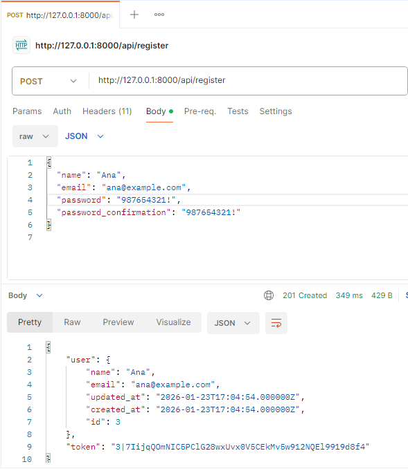
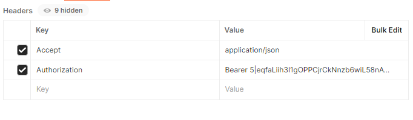
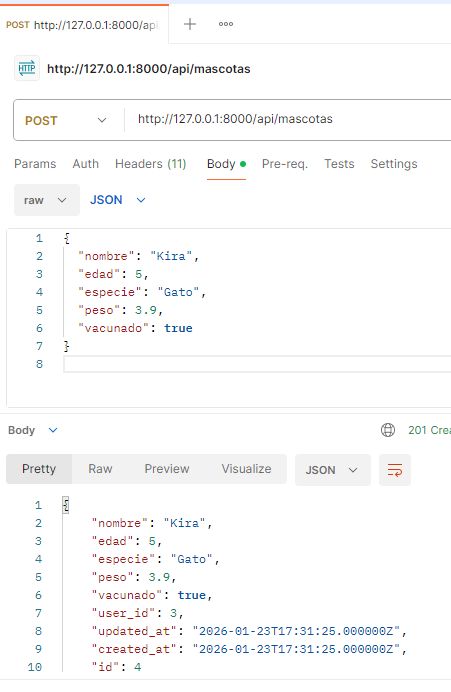
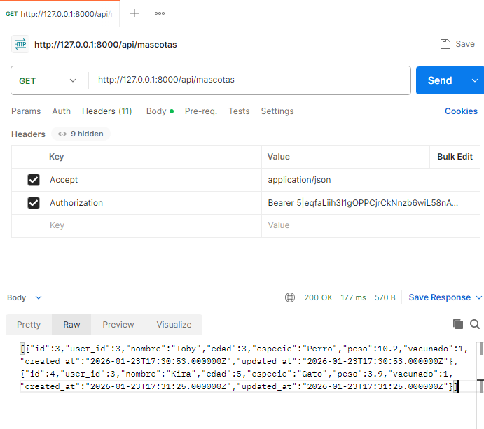
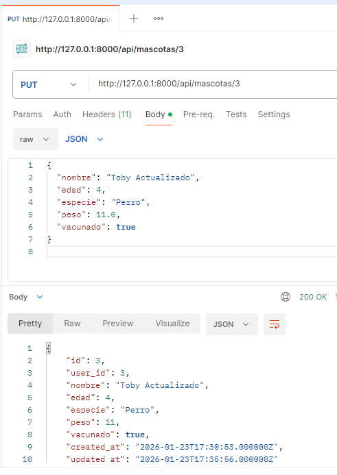
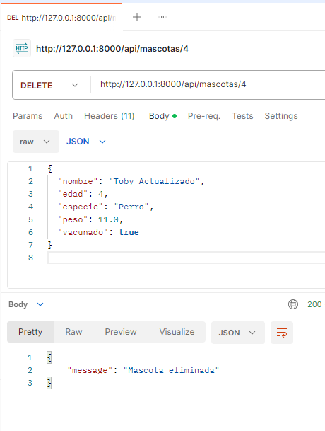

# API REST con Laravel 12 + Sanctum  
Proyecto completo con autenticación, CRUD de Mascotas y Posts, y filtrado avanzado.

---

## 🚀 Requisitos
- PHP 8.2+
- Composer
- MySQL / MariaDB
- Laravel 11
- Postman

---

## 📦 Instalación

```
git clone <tu-repo>
cd <tu-proyecto>
composer install
cp .env.example .env
php artisan key:generate
```

---

## ⚙️ Configura tu base de datos en .env
```
DB_DATABASE=laravel_api
DB_USERNAME=root
DB_PASSWORD=
```

---

## 🔐 Instalación de Laravel Sanctum
```
composer require laravel/sanctum
php artisan vendor:publish --provider="Laravel\Sanctum\SanctumServiceProvider"
php artisan migrate
```

---

# 🔐 1. Rutas de Autenticación (register, login, user)

Estas rutas permiten registrar usuarios, iniciar sesión y obtener el usuario autenticado usando Laravel Sanctum.

```php
// routes/api.php

use App\Http\Controllers\AuthController;
use Illuminate\Http\Request;

Route::post('/register', [AuthController::class, 'register']);
Route::post('/login', [AuthController::class, 'login']);

Route::middleware('auth:sanctum')->group(function () {
    Route::get('/user', function (Request $request) {
        return $request->user();
    });
});
```
## Ejemplo JSON para registro - POST register
```
{
  "name": "Ana",
  "email": "ana@example.com",
  "password": "987654321!",
  "password_confirmation": "987654321!"
}
```



## 🪙 Añadir Token en Postman

Al crear un usuario mediante la ruta http://127.0.0.1:8000/api/register nos devuelve un token, devemos de añadirlo en la seccion Header.



Lo necesitamos para interactuar como usuario autenticado en Postman y poder recrear las distintas acciones.

## Peticion POST de Mascotas 




## Peticion GET Mascotas


## Actualizacion datos con peticion PUT



## Peticion DELETE


